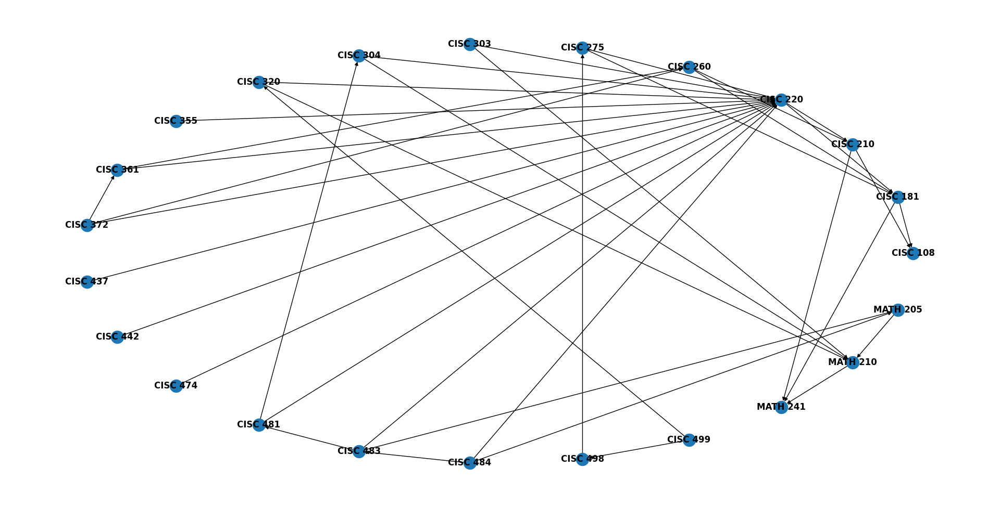
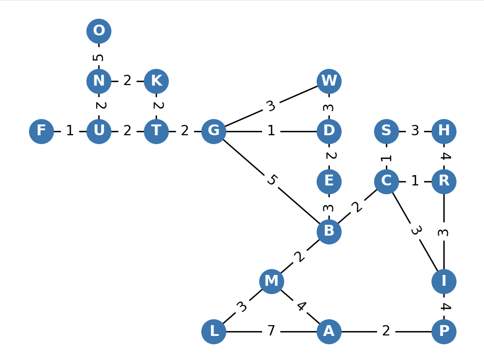
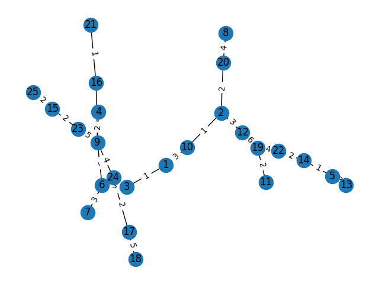
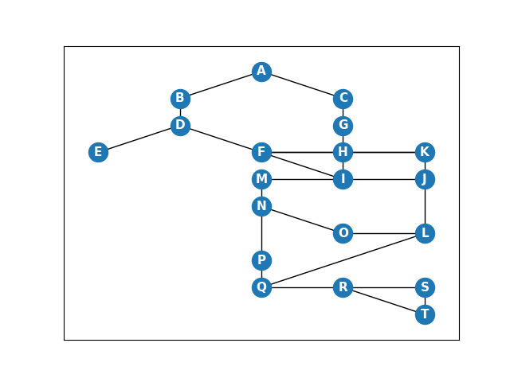

# Campus Life & Graphing

**CISC320 Spring 2023 Lesson 14 - Graph Applications**

Group Members:

- Simon Brugel (sbrugel@udel.edu)
- Aman Singh (amans@udel.edu)
- Ryan Sanchez (ryansan@udel.edu)
- Gavin Caulfield (gavcaul@udel.edu)

Description of project

## Installation Code

```sh
$> pip install networkx
$> pip install matplotlib
```

## Python Environment Setup

```python
import networkx as nx
import matplotlib.pyplot as plt
```

---

# Depth-First Search: Finding Course Prerequisites

**We are given the course catalog of UD's Computer Science AI Concentration, consisting of all "core" courses and a few extra electives. Given this catalog, written as a directed graph with edges connecting classes to their prerequisites (as well as certain "recommended" classes), as well as a string containing a course ID, use depth-first search to list ALL classes one needs to take to be able to take this class. For example, CISC 220 requires 210, which requires 108, and strongly recommends 181. CISC 210 also requires MATH 241. So CISC 108, CISC 181, MATH 241, and CISC 210 will be listed as required courses.**:

> **Formal Description**:
>
> - Input: A directed graph, consisting of courses and edges as specified above (type: nx.DiGraph); a valid course ID (i.e. 'CISC 481') (type: str).
> - Output: A list of the edges that were traversed from that course, using depth first search (type: generator).

**Graph Problem/Algorithm**: [DFS]

**Setup code**:

```python
src_course = 'CISC 481'

G = nx.DiGraph() # create a new Graph
G.add_node('CISC 108') # add nodes
G.add_node('CISC 181')
G.add_node('CISC 210')
G.add_node('CISC 220')
G.add_node('CISC 260')
G.add_node('CISC 275')
G.add_node('CISC 303')
G.add_node('CISC 304')
G.add_node('CISC 320')
G.add_node('CISC 355')
G.add_node('CISC 361')
G.add_node('CISC 372')
G.add_node('CISC 437')
G.add_node('CISC 442')
G.add_node('CISC 474')
G.add_node('CISC 481')
G.add_node('CISC 483')
G.add_node('CISC 484')
G.add_node('CISC 498')
G.add_node('CISC 499')
G.add_node('MATH 241')
G.add_node('MATH 210')
G.add_node('MATH 205')

# direct requirements get a single directed edge
G.add_edge('CISC 181', 'CISC 108') # add edges
G.add_edge('CISC 210', 'CISC 108')
G.add_edge('CISC 220', 'CISC 210')
G.add_edge('CISC 260', 'CISC 210')
G.add_edge('CISC 275', 'CISC 181')
G.add_edge('CISC 275', 'CISC 220')
G.add_edge('CISC 303', 'CISC 220')
G.add_edge('CISC 304', 'CISC 220')
G.add_edge('CISC 320', 'CISC 220')
G.add_edge('CISC 361', 'CISC 220')
G.add_edge('CISC 361', 'CISC 260')
G.add_edge('CISC 372', 'CISC 220')
G.add_edge('CISC 372', 'CISC 260')
G.add_edge('CISC 437', 'CISC 220')
G.add_edge('CISC 442', 'CISC 220')
G.add_edge('CISC 474', 'CISC 220')
G.add_edge('CISC 481', 'CISC 220')
G.add_edge('CISC 481', 'CISC 304')
G.add_edge('CISC 483', 'CISC 220')
G.add_edge('CISC 484', 'CISC 220')
G.add_edge('CISC 498', 'CISC 275')
G.add_edge('CISC 499', 'CISC 498')
G.add_edge('CISC 499', 'CISC 320')
G.add_edge('MATH 210', 'MATH 241')
G.add_edge('MATH 205', 'MATH 210')
G.add_edge('CISC 303', 'MATH 210')
G.add_edge('CISC 304', 'MATH 210')
G.add_edge('CISC 320', 'MATH 210')
G.add_edge('CISC 483', 'MATH 205')
G.add_edge('CISC 484', 'MATH 205')

# other edges, based on the recommended path, not necessarily requirements
G.add_edge('CISC 181', 'MATH 241')
G.add_edge('CISC 210', 'MATH 241')
G.add_edge('CISC 220', 'CISC 181')
G.add_edge('CISC 260', 'CISC 181')
G.add_edge('CISC 355', 'CISC 220')
G.add_edge('CISC 483', 'CISC 481')
G.add_edge('CISC 484', 'CISC 483')
G.add_edge('CISC 372', 'CISC 361')

find_requirements(G, src_course) # implementation details below.
nx.draw(G, pos=nx.circular_layout(G), with_labels=True, font_weight='bold')
plt.show()
```

**Visualization**:



**Solution code:**

```python
def find_requirements(graph: nx.DiGraph, course_id: str):
    try:
        dfs_from_source = nx.dfs_edges(G, source=src_course)
        for edge in dfs_from_source:
            print(edge)
    except KeyError:
        print('ERROR: Invalid course ID supplied.')
```

**Output**

```
('CISC 481', 'CISC 220')
('CISC 220', 'CISC 210')
('CISC 210', 'CISC 108')
('CISC 210', 'MATH 241')
('CISC 220', 'CISC 181')
('CISC 481', 'CISC 304')
('CISC 304', 'MATH 210')
```

**Interpretation of Results**:

The course requirements for CISC 481 are as follows:

- CISC 220 (direct requirement)
- CISC 210 (needed for 220)
- CISC 108 (needed for 210)
- MATH 241 (needed for 210)
- CISC 181 (needed for 220)
- CISC 304 (direct requirement)
- MATH 210 (needed for 304)

---

# Shortest Path Between Educational Campus Buildings

**Informal Description**:

There are lots of educational buildings spread around campus. The locations of these can be mapped and each close pair of buildings can be thought of as connected by a distance. Given an input of 20 of these educational buildings (along with distances for each close pair of buildings) and a building to start from, we're looking to find the shortest possible distances between the "source" building and every other building. The distances between each pair of close buildings (measured in minutes based on the estimated walking distance from Google Maps) can form a walkable path between any two buildings.

**Formal Description**:

> - Inputs: 1) A weighted, undirected graph with nodes representing educational campus buildings and edges representing the estimated walking distance between each pair of buildings (in minutes, calculated by Google Maps) and 2) a source node from which to begin the traversal.
> - Output: A list of the shortest path lengths between the source node and each other connected node in the graph (type: generator).

**Graph Problem/Algorithm**:

Single-Source Shortest Path (Dijkstra's Algorithm)

**Node Building Letters**:

To make the graph easier to read, each building has been assigned to a letter. This is the first letter of the building name when possible, or at the very least the representative letter is somewhere in the name.

- Alison Hall (A)  
- Brown Lab (B)  
- Colburn Lab (C)  
- Du Pont Hall (D)  
- Evans Hall (E)         
- Alfred Lerner Hall (F)  
- Gore Hall (G)  
- Graham Hall (H)  
- Harker ISE Lab (I)   
- Kirkbride Hall (K)  
- Morris Library (L)  
- Memorial Hall (M)  
- Ewing Hall (N)  
- McDowell Hall (O)  
- Penny Hall (P)   
- Pearson Hall (R)  
- Spencer Lab (S)  
- Smith Hall (T)  
- Purnell Hall (U)  
- Wolf Hall (W)  

**Visualization**:



**Solution Code**:

```python
import networkx as nx
import matplotlib.pyplot as plt

# algorithm to find the shortest paths from a source to all other nodes
def find_shortest_paths(graph: nx.Graph, source: str, nodes: list[str]):
    try:
        length, path = nx.single_source_dijkstra(graph, source)
        for node in nodes:
            print(f"{node}: {length[node]}")
    except KeyError:
        print('Error: Invalid building supplied.')

# create a new undirected Graph
G = nx.Graph()

# add the 20 building nodes
    # string of node-xpos-ypos
buildings = "A61 B63 C74 D65 E64 F15 G45 H85 I82 K36 L41 M52 N26 O27 P81 R84 S75 T35 U25 W66".split(' ')
for building in buildings:
    G.add_node(building[0], pos = (int(building[1]), int(building[2])))

# add the 26 weighted, undirected edges
    # string of node1-node2-weight
edges = "AL7 AM4 AP2 BC2 BE3 BG5 BM2 CI3 CR1 CS1 DE2 DG1 DW3 FU1 GT2 GW3 HR4 HS3 IP4 IR3 KN2 KT2 LM3 NO5 NU2 TU2".split(' ')
for edge in edges:
    G.add_edge(edge[0], edge[1], weight = int(edge[2]))

# find the shortest path from McDowell Hall (O) to each other building
nodes = [building[0] for building in buildings]
find_shortest_paths(G, 'O', nodes)

# generate and display the graph
node_positions = nx.get_node_attributes(G, 'pos')
edge_weights = nx.get_edge_attributes(G, 'weight')

nx.draw_networkx_nodes(G, pos=node_positions)
nx.draw_networkx_labels(G, pos=node_positions, font_color='white', font_size=11, font_weight='bold')
nx.draw_networkx_edges(G, pos=node_positions)
nx.draw_networkx_edge_labels(G, pos=node_positions, edge_labels=edge_weights)
plt.show()
```

**Output**:

The following is the output for the called function, which is the distances from McDowell Hall (O) to all of the other educational campus building nodes:

A: 22  
B: 16  
C: 18  
D: 12  
E: 14  
F: 8  
G: 11  
H: 22  
I: 21  
K: 7  
L: 21  
M: 18  
N: 5  
O: 0  
P: 24  
R: 19  
S: 19  
T: 9  
U: 7  
W: 14  

**Interpretation of Results**:

The results from this function can be very useful for understanding the layout of the UD campus. This result in particular shows the relative distance from McDowell Hall to every other represented building. Although the weights are based on walking distance in minutes, the shortest-path lengths should not be taken to mean walking times. However, they are generally accurate relative to other nodes, so, for example, it will take much less time from McDowell to Kirkbride Hall (K: 7) than from McDowell to Penny Hall (P: 24).

---

# Minimum Distance to Check Every Blue Light

**Informal Description**:
Many college campuses, including UD, have blue safety lights
all across campus, which when press will connect you with the police.
However, every year, these are required to be checked to ensure functionality.
As said before, these are all across campus, and checking every single one would require
a lot of time and energy. We want to find a path/way to hit every single blue light in the
least amount of distance travelled.

> **Formal Description**:
>
> - Input: A text file formatted as an adjacency matrix, splitting up each edge
>   by commas.
>
>   Example:
>
> 0, 0, 3, 2,  
> 0, 0, 4, 2,  
> 3, 4, 0, 2,  
> 2, 2, 2, 0,
>
> - Output: A Minimum Spanning Tree and a printed picture of said Tree

**Graph Problem/Algorithm**: [MST]

**Setup code**:

```python
import matplotlib.pyplot as plt
if __name__ == "__main__":

    G = nx.Graph()
    with open('path.txt') as f:
        x = 1
        for line in f:
            values = line.strip().split(",")
            for y, value in enumerate(values, start=1):
                if value.strip().isnumeric() and int(value) != 0:
                    G.add_edge(x, y, weight=int(value))
            x += 1

```

**Visualization**:


**Solution code:**

```python
    G = nx.minimum_spanning_tree(G, weight='weight', algorithm='prim', ignore_nan=False)
    pos = nx.spring_layout(G)
    nx.draw(G, pos, with_labels=True)
    edge_labels = nx.get_edge_attributes(G, 'weight')
    nx.draw_networkx_edge_labels(G, pos, edge_labels=edge_labels)
    plt.show()

```

**Output**


**Interpretation of Results**:
If you follow the path/tree shown, you will visit every blue light while
traveling the least distance possible.


---

# Conflict-Free Exam Schedule

**Informal Description**:
UD offers many courses, and each course needs a time slot to be able to hold a final exam. However, the exams need to be scheduled in a way that prevents conflicts between exams due to students taking both classes or other conflicts. Given a list of exams that need to be administered, schedule these exams in a way that avoids conflicts with courses and students. Find a schedule that prevents any conflicting exams from being held in the same timeslot.

> **Formal Description**:
>
> - Input: A text file formatted as an adjacency matrix, splitting up each edge
>   by commas.
>
>   Example:
>
>   0, 0, 3, 2,  
> 0, 0, 4, 2,  
> 3, 4, 0, 2,  
> 2, 2, 2, 0,
>
> - Output: A schedule listing a timeslot and the exam, as well as the graph.  
>   Example:  
>   A: Timeslot 1  
>   B: Timeslot 2  
>   C: Timeslot 1

**Graph Problem/Algorithm**: [BFS]

**Setup code**:

```python
import networkx as nx
import matplotlib.pyplot as plt

G = nx.Graph()

# add the 20 exam nodes
exams = "A49 B38 C58 D37 E26 F46 G57 H56 I55 J65 K66 L63 M45 N44 O53 P42 Q41 R51 S61 T60".split(' ')
for exam in exams:
    G.add_node(exam[0], pos = (int(exam[1]), int(exam[2])))

edges = "AB AC BD BA CG DE ED DF DB FH FD FI FK GH HG HI HK IJ IF IM JK JL LO MN IM NO NP ON LQ PQ QR QP RS RT SR TR ST TS".split()
for edge in edges:
    G.add_edge(edge[0], edge[1])

find_exam_schedule(G, src_exam)

node_positions = nx.get_node_attributes(G, 'pos')
edge_weights = nx.get_edge_attributes(G, 'weight')

nx.draw_networkx_nodes(G, pos=node_positions)
nx.draw_networkx_labels(G, pos=node_positions, font_color='white', font_size=11, font_weight='bold')
nx.draw_networkx_edges(G, pos=node_positions)
nx.draw_networkx_edge_labels(G, pos=node_positions, edge_labels=edge_weights)
plt.show()

```

**Visualization**:



**Solution code:**

```python
def find_exam_schedule(graph: nx.DiGraph, course_id: str):
    try:
        colors = {}
        # Breadth-first search with coloring for exam schedule
        bfs_tree = nx.bfs_tree(graph, course_id)
        for node in bfs_tree:
            avail_colors = set(range(len(graph)))
            for neighbor in graph.neighbors(node):
                if neighbor in colors:
                    avail_colors.discard(colors[neighbor])
            # Choose the first available color for the node
            colors[node] = min(avail_colors)
        for exam, color in colors.items():
            print(f"{exam}: Timeslot {color+1}")
    except KeyError:
        print('ERROR: Invalid exam supplied.')
src_exam = 'A'

```

**Output**
```
A: Timeslot 1
B: Timeslot 2
C: Timeslot 2
D: Timeslot 1
G: Timeslot 1
E: Timeslot 2
F: Timeslot 2
H: Timeslot 3
I: Timeslot 1
J: Timeslot 3
K: Timeslot 1
M: Timeslot 2
L: Timeslot 1
N: Timeslot 1
O: Timeslot 2
Q: Timeslot 2
P: Timeslot 3
R: Timeslot 1
S: Timeslot 2
T: Timeslot 3
```

**Interpretation of Results**:
The exams are split up into timeslots which allow the exams to be administered without conflicts between them. 
